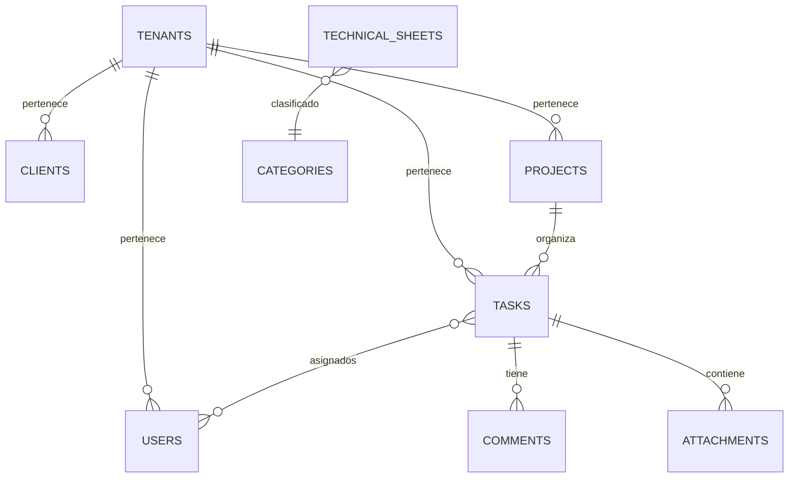
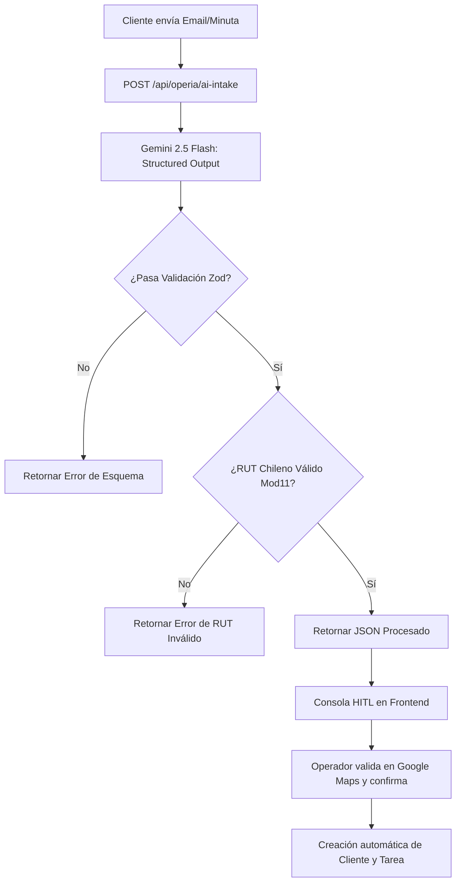

# Documentación Técnica Completa: Operia SaaS

Este documento sirve como la única fuente de verdad técnica para la arquitectura, esquema de base de datos, flujos de datos e integraciones de la plataforma **Operia** (SaaS de Gestión Operativa).

---

## 📋 Estructura General del Repositorio

El proyecto está estructurado de forma monolítica pero modular, separando la lógica del servidor REST/WebSocket en el backend y la interfaz reactiva en el frontend.

```text
operia/
├── backend/                    # Servidor Express.js (REST & WebSocket)
│   ├── config/                 # Configuración de base de datos y servicios
│   ├── middleware/             # Middlewares (autenticación JWT y scope multi-tenant)
│   ├── routes/                 # Enrutadores de la API (Soporte dual SQLite/PostgreSQL)
│   │   ├── auth.routes.js      # Registro e inicio de sesión con subdominios
│   │   ├── tasks.routes.js     # Gestión del tablero Kanban y ciclo de vida
│   │   ├── operiaIntakeRoutes.js # Extracción estructurada AI Intake (Gemini)
│   │   ├── knowledgeRoutes.js  # Búsqueda semántica RAG + Juez de Veracidad (pgvector)
│   │   └── payments.routes-postgres.js # Webhooks e integración de pagos Flow.cl
│   ├── services/               # Servicios de correos (Resend), templates y cron jobs
│   ├── db.js                   # Inicialización y queries para SQLite (Desarrollo)
│   ├── db-postgres.js          # Inicialización, pool y esquemas para PostgreSQL (Producción)
│   └── server.js               # Punto de entrada de la aplicación
│
├── frontend/                   # Interfaz de Usuario (SPA reactiva)
│   ├── css/                    # Estilos globales y específicos del tablero
│   ├── js/                     # Lógica en Javascript puro y llamadas a API
│   │   ├── api.js              # Cliente HTTP axial para peticiones al backend
│   │   └── tasks.js            # Lógica y reactividad del tablero en Vue.js 3
│   ├── tablero.html            # Consola operativa principal (Tablero Kanban)
│   └── registro.html           # Formulario dinámico de registro multi-tenant
│
├── nginx.conf                  # Configuración de proxy inverso y SSL en producción
├── package.json                # Dependencias generales de Node.js
└── DEPLOYMENT.md               # Guía técnica paso a paso para puesta en producción
```

---

## 🗄️ Arquitectura de Base de Datos y Modelo de Datos

Operia utiliza una arquitectura de datos adaptativa: **SQLite3** en desarrollo local (para facilitar la portabilidad) y **PostgreSQL 15+** en producción (para alta concurrencia y soporte multi-tenant nativo).



### Esquema PostgreSQL Multi-Tenant (Producción)

#### 1. Tabla `tenants`
Administra el aislamiento a nivel de organización.
* `id` (SERIAL PRIMARY KEY)
* `name` (VARCHAR): Nombre de la empresa.
* `subdomain` (VARCHAR UNIQUE): Subdominio asignado (ej: `demo`).
* `plan` (VARCHAR): `starter`, `professional` o `enterprise`.
* `subscription_status` (VARCHAR): Estado de suscripción (`trial`, `active`, `suspended`).
* `trial_ends_at` (TIMESTAMP)
* `max_users` / `max_clients` / `storage_limit_mb` (INTEGER): Restricciones del plan.

#### 2. Tabla `users`
* `id` (SERIAL PRIMARY KEY)
* `tenant_id` (INTEGER REFERENCES tenants(id)): Clave de aislamiento multi-tenant.
* `name` / `email` / `password` (VARCHAR)
* `office` (VARCHAR): Oficina física asignada.
* `role` (VARCHAR): Permisos (`admin`, `user`).
* `is_active` (BOOLEAN): Estado de cuenta.
* *Índice Único:* `UNIQUE(tenant_id, email)`

#### 3. Tabla `tasks`
Maneja el núcleo del tablero Kanban.
* `id` (SERIAL PRIMARY KEY)
* `tenant_id` (INTEGER REFERENCES tenants(id))
* `project_id` (INTEGER REFERENCES projects(id))
* `title` (VARCHAR) / `description` (TEXT)
* `due_date` (TIMESTAMP): Fecha de vencimiento.
* `priority` (VARCHAR): `baja`, `media`, `alta`.
* `status` (VARCHAR): Estado en tablero (`pendiente`, `en camino`, `completada`).
* `completed_at` (TIMESTAMP): Registro temporal del cambio a Completada.
* `is_archived` (BOOLEAN): Flag para auto-archivado.
* `responsible_user_id` / `observer_user_id` (INTEGER REFERENCES users(id)): Asignación de roles.
* `human_id` (VARCHAR): Código legible (ej: `TK-1002`).

#### 4. Tabla `knowledge_base_chunks` (Base Vectorial)
Utiliza la extensión `pgvector` para soporte de búsquedas semánticas de soporte.
* `id` (SERIAL PRIMARY KEY)
* `document_name` (VARCHAR)
* `content` (TEXT)
* `embedding` (VECTOR(768)): Vector de 768 floats generado por Gemini.
* *Índice Especial HNSW:* `USING hnsw (embedding vector_cosine_ops)` para búsquedas de alta velocidad.

---

## 🤖 Módulos Técnicos Clave

### 1. Operia AI Intake (Ingesta Inteligente de Tareas)
Permite ingresar texto desestructurado (minutas, chats, correos de clientes) y transformarlo automáticamente en tareas Kanban validadas.



*   **Extracción Estructurada**: Utiliza el SDK de Gemini configurado con `responseMimeType: "application/json"` y un esquema OpenAPI estricto.
*   **Validación de RUT**: Implementa una función de backend que calcula el dígito verificador del RUT chileno mediante el algoritmo del **Módulo 11** de forma matemática determinista.
*   **Human-in-the-Loop (HITL)**: La interfaz en Vue.js renderiza los campos extraídos y permite al operador corregirlos y geolocalizar la dirección en Google Maps antes de guardar.

### 2. Agente RAG B2B de Soporte
Un pipeline conversacional que asiste a los técnicos con los manuales internos oficiales, controlando las alucinaciones del LLM.
*   **Draft Node**: Genera la respuesta técnica base (`temperature: 0.0`) a partir de los 3 fragmentos semánticamente más similares recuperados de PostgreSQL usando la distancia coseno (`1 - (embedding <=> $1::vector)`).
*   **Judge Node**: Un auditor con temperatura 0.0 que valida la fidelidad semántica de la respuesta sugerida contra los fragmentos reales. Retorna un JSON estructurado `{ score: Float, reason: String }`.
*   **Gating de Seguridad**: Si el `score` es menor a `0.8` (alucinación detectada), intercepta la salida y devuelve un mensaje seguro recomendando contactar al soporte por WhatsApp (`https://wa.me/56940413646`).

### 3. Comunicación en Tiempo Real (WebSockets)
*   Express inicializa un servidor WebSocket (`ws`) en conjunto con el servidor HTTP.
*   Al realizar cualquier modificación en el tablero Kanban (crear, arrastrar o archivar tarea), el servidor difunde un mensaje JSON a todas las conexiones activas dentro del mismo `tenant_id`.
*   El frontend Vue.js reconecta automáticamente tras caídas de red y actualiza el estado de las columnas sin recargar la página.

### 4. Ciclo de Vida y Archivado Automático
*   **Estados**: `pendiente` ➡️ `en camino` ➡️ `completada`.
*   **Archivado**: Un cron de base de datos corre periódicamente y marca las tareas como `is_archived = 1` si llevan en estado `completada` más de 48 horas sin modificaciones. Esto optimiza el rendimiento del frontend.

---

## 📡 Catálogo Principal de Endpoints de la API

### Autenticación y Tenants
*   `POST /api/auth/signup-tenant`: Registra una nueva organización (tenant) y su administrador principal. Habilita también la creación de oficinas personalizadas durante el proceso.
*   `POST /api/auth/login`: Identifica al usuario bajo su subdominio respectivo y devuelve un token JWT.
*   `POST /api/auth/forgot-password`: Genera tokens de restauración de contraseña y los envía por correo.

### Tareas y Kanban (Bajo scope de Tenant)
*   `GET /api/tasks`: Devuelve las tareas no archivadas asociadas al tenant del usuario autenticado.
*   `POST /api/tasks`: Crea una tarea y le asigna secuencialmente un `human_id` legible.
*   `PUT /api/tasks/:id`: Actualiza la información, responsable, prioridad o columna del tablero.
*   `DELETE /api/tasks/:id`: Elimina la tarea de forma física o lógica según el rol del usuario.

### AI Intake & RAG
*   `POST /api/operia/ai-intake`: Ingesta inteligente mediante minutas. Requiere token de autenticación.
*   `POST /api/operia/knowledge-search`: Retorna las coincidencias semánticas en dbeaver/PostgreSQL.
*   `POST /api/operia/knowledge-chat`: Interfaz conversacional RAG que ejecuta la verificación del juez.

---

## 🚀 Despliegue, Monitoreo y Respaldo en Producción

Consulte el archivo **[DEPLOYMENT.md](file:///home/juan/D/proyecto/operia/DEPLOYMENT.md)** para la guía paso a paso de despliegue en la máquina virtual Ubuntu de Oracle Cloud (OCI).

### Monitoreo en Servidor (PM2)
*   Ver logs: `pm2 logs operia`
*   Ver estado de recursos: `pm2 monit`

### Respaldo de Base de Datos (Backups)
*   El script local `backup-db.sh` genera volcados de la base de datos PostgreSQL y los almacena localmente en la carpeta `backups/`. Se recomienda configurar una tarea programada cron:
    ```bash
    0 2 * * * /home/ubuntu/operia/backup-db.sh >> /home/ubuntu/operia/backups/backup.log 2>&1
    ```
